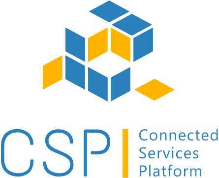

# CSP-Documentation

## About Project

Eclipse Connected Services Platform (CSP) offers a comprehensive platform with all the essential components needed by automotive OEMs to develop end-to-end connected vehicle software solutions. Eclipse CSP binds together Cloud Computing Framework with platform for connecting vehicle and Reference Mobile Application.

It provides a Multi-layered Architecture for faster development, improved scalability, separation of concerns and enhanced maintainability. This architecture enables the implementer to leverage cloud-based solutions along with options to retain critical or sensitive components within an on-premises data center.

## Usage

For using ECSP, refer <https://github.com/eclipse-ecsp/ecsp-website>

## Contribution

This project welcomes contributions and suggestions. Before contributing, make sure to read the
[Contributing](template/CONTRIBUTING.template.md) file in specific components.

## MKDocs Material

MkDocs material is a modern, responsive theme for MkDocs, designed for creating beautiful documentation websites.

## Installation guide for mkdocs-material

1. Install python and pip:
Check using below commands, if python and pip are installed  
`python --version`  
`pip --version`
2. Install MkDocs Material using following command:  
`pip install mkdocs-material`
3. Verify if installation is completed by using following command:  
`mkdocs --version`

## How to run the project

1. Go to the `ecsp-website` location and start the local development server using the following command:  
`mkdocs serve`  
it will start serving on <http://127.0.0.1:8000>
2. Build mkdocs by using following command:  
`mkdocs build`  
This command will process all markdown files in docs folder and generate a static website inside site folder.

## License

For using ECSP, refer [LICENSE](./LICENSE.md)
