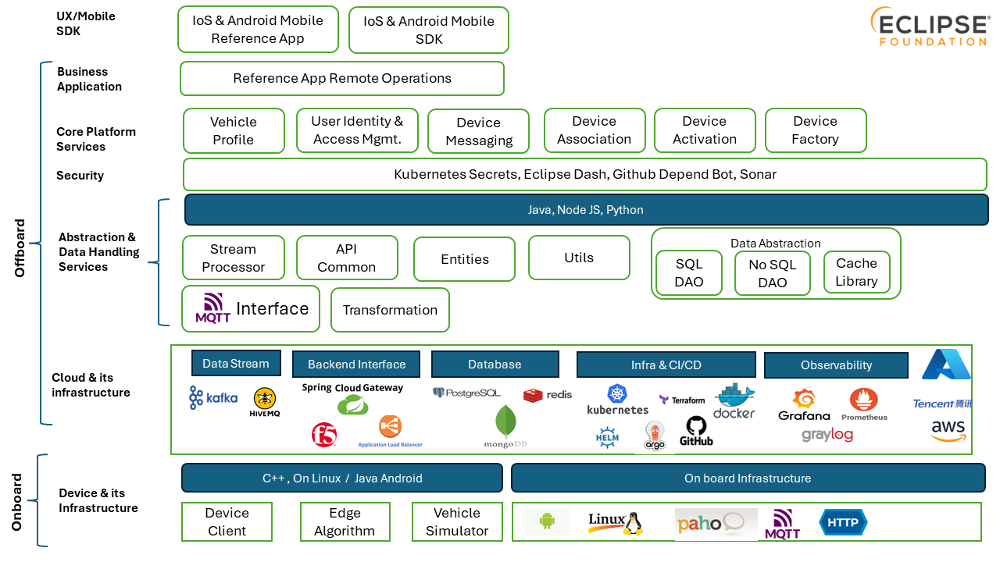

# CSP-Documentation

## Introduction

Eclipse Connected Services Platform (CSP) offers a comprehensive platform with all the essential components needed by automotive OEMs to develop end-to-end connected vehicle software solutions. The Eclipse CSP provides functionalities for data management, vehicle management (profiles, devices, settings), user access control, notification channels, vehicle client, and integration with various open-source softwares.
Eclipse CSP binds together Cloud Computing Framework with platform for connecting vehicle and Reference Mobile Application.
Built on a microservices architecture, the Eclipse CSP enables modular development and deployment. It provides a Multi-layered Architecture for faster development, improved scalability, separation of concerns and enhanced maintainability.
In addition to the core Eclipse CSP platform, the offering includes a reference application (Remote Operations) on the Cloud, a device client for embedded devices (IVI/ECU/TCU) on vehicles, a vehicle simulator which simulates device client present on vehicle which connects to cloud over MQTT, and a reference mobile application (iOS/Android). These components demonstrate the process of building new automotive services on this platform. By leveraging the data collected from the vehicles, the Eclipse CSP aims to foster a community that creates novel applications and services.
This platform is designed for scalability to connect large vehicle fleets with single-click deployment scripts that streamline setup and validation.

Eclipse CSP documentation is stored in GitHub at the following location: <https://github.com/eclipse-ecsp/ecsp-website>

### System Diagram

### Diagram Details

#### Offboard Layer

##### UX/Mobile SDK

* **IOS & Andriod Mobile Reference App** - Reference mobile apps on IOS and Android to provide insights on usage of feature specific api to perform operations from mobile by user. example: Remotely lock / unlock door of a car from mobile app.
* **IOS and Android Mobile SDK** - Provides an API interface for Remote Operation and User Authentication. Remote operations mobile apps can be designed by using the VehicleConnectSDK

##### Business Application

* [**Reference App Remote Operations**](#available-soon) - Application for vehicles to control door, window, lights, horn, alarm, trunk, and demonstrate how new services can be written using the core platform layer.

##### Core Platform Services

* [**Vehicle Profile**](#available-soon) -  Responsible for creating and maintaining a profile of each vehicle that is on-boarded to the platform. It holds vehicle-specific details and device details (ECUs/IVI/HU) installed on a vehicle, along with capabilities and services provisioned for a vehicle/device combination.
* [**User Identity and Access Management (UIDAM)**](https://github.com/eclipse-ecsp/uidam-authorization-server) - IDAM Service(s) for OAuth2 implementation
* [**Device Messaging**](#available-soon) - Responsible for interfacing all communication with the device. Inbound messages are routed via Device Messaging before services process messages. Outgoing messages from services to devices are also routed via Device Messaging. Under the hood, it does tracks the device connection status with HiveMQ, persisting events in database if a vehicle is inactive and waking a device if its inactive.
* [**Device Association**](#available-soon) - Associate a device to the user
* [**Device Activation**](#available-soon) - Move the device into associated state and send a request to create Vehicle Profile
* [**Device Factory**](#available-soon) - Admin user will manually request to create a new device with required attributes for each vehicle

##### Security

* **Kubernetes Secrets** - A Kubernetes secret is an object that stores sensitive data, such as passwords, tokens, and keys. This data is used to authenticate and authorize access to applications and services.  z
* **Eclipse Dash** - Eclipse Dash is a place where the community itself collaborates on tools for community awareness and collaboration in support of our ultimate objective of committer quality and cooperation.

##### Abstraction & Data Handling Service

* **Java** - Java is a programming language and computing platform that's used to create applications for many devices, including smartphones, servers, and the web
* **Node JS** - Node.js is an open-source, cross-platform JavaScript runtime environment that executes JavaScript code outside of a web browser.
* **Python** - Python is a programming language that is used for web development, software development, data science, and machine learning.
* **Stream Processor** - A Kafka streams based backend application which processes the real time data coming from vehicle.
* [**API Common**](#available-soon) - represent a set of common services that provide a foundation for flexibility and rapid service creation. It exposes common REST based tasks related to health monitors, metrics, JSON support functions and push message to Kafka cluster etc
* [**Entities**](https://github.com/eclipse-ecsp/entities) - Provides abstraction for event specifications and centralises common entities. Provides support for related commmon functionalities like Serialization, Automatic auditing of entities, retries, event lifecycle hooks and mappings
* [**Utils**](https://github.com/eclipse-ecsp/utils) - Provides Utility functionality such as centralized logging, health checks, diagnostic data reporting and application metrics such as counters, gauges and histograms
* [**MQTT Interface (HiveMQ)**](#available-soon) - Supported lightweight MQTT Broker apt for IOT data communication
* **Transformation**  - Provides generic functionality to transform the external client related events to those required  for backend  processing

###### Data Abstraction

* [**SQL DAO**](https://github.com/eclipse-ecsp/sql-dao) - Data Access Layer abstracting the RDBMS (Postgres) operations
* [**NOSQL DAO**](https://github.com/eclipse-ecsp/nosql-dao) - Data Access Layer abstracting the NoSQL MongoDB operations using Morphia as Object Document Mapper
* **Cache Library** - Abstraction library for interfacing with Redis Cache

##### Cloud & its Infrastructure

###### Data Stream

* **Kafka** - Real-time streaming data pipelines that reliably get data between devices and services. Kafka is used in Connected services platform backend for inter service communication. Zookeeper is a centralized service for maintaining configuration information and providing distributed synchronization for services
* [**HiveMQ**](#available-soon) - Connected services platform uses HiveMQ broker to communicate with vehicles for all V2C and C2V use cases.

###### Backend Interface

* [**API Gateway (Spring Cloud Gateway)**](https://github.com/eclipse-ecsp/api-gateway) - Exposes business APIs that are being consumed by applications, mobile apps, web portals and third parties.

###### Database

* **PostgreSQL** - Postgres is used as a database for CSP components like User Identity Management and Api-Gateway.  
* **Redis** - Redis is used as a cache in CSP to store details that need quick access to micro services.
* **MongoDB** - MongoDB is used to store service/feature specific event data coming from vehicles to cloud.

###### Infra and CI/CD

* **Kubernetes** - Kubernetes is open-source software that helps you manage, scale, and deploy containerized applications. It's also known as "k8s" or "k-eights".
* **Terraform** - Terraform is an infrastructure as code tool that lets you define both cloud and on-prem resources in human-readable configuration files that you can version, reuse, and share.
* **Docker** - Docker helps developers build, share, run, and verify applications anywhere — without tedious environment configuration or management.
* **Helm** - Helm is a package manager for Kubernetes, simplifying the deployment, management, and lifecycle of applications on Kubernetes clusters, by packaging them into "charts" which are then deployed using the Helm CLI.
* **Argo CD** - Argo CD is a declarative, GitOps continuous delivery tool for Kubernetes that uses Git repositories as the source of truth for defining application state and automates deployments
* **GitHub** - GitHub is a website that helps users manage and share code using the open-source version control tool Git.

###### Observability

* **Grafana** - Dashboards to show memory usage, cpu usage of microservices.
* **Prometheus** - Prometheus is an open-source systems monitoring and alerting toolkit that collects and stores metrics as time series data.
* **Graylog** - Graylog is a powerful, open-source log management tool that centralizes, indexes, and analyzes log data from various sources.

###### Cloud

* **AWS** - Cloud infra that hosts CSP microservices

#### Onboard Layer

##### Device & its Infrastructure

* [**Device Client**](https://github.com/eclipse-ecsp/device-client) - A C++ Client, ready to be deployed on TCUs/ECUs/IVI to validate the RO application use case. Vehicles (using a Device client paho/MQTT) transmit data using a lightweight MQTT protocol, minimizing data overhead and optimizing bandwidth usage.
* **Edge Algorithm** - The logic present at vehcile(device), which converts raw data to necessary format understood by cloud and which sends the data to cloud through predefined protocol (MQTT)
* **Vehicle Simulator** -  A Linux-based vehicle simulator capable of simulating vehicle messages or receiving and responding to messages from a Cloud application. This is provided for testing and development purposes.

### Release Notes page showing Highlights, Changelog etc for each release

&nbsp;&nbsp;&nbsp;&nbsp;[Release Notes](./release/release_notes_guidelines.md)

### Developer Guidelines

* **To build the project from source code**  
[Build Guidelines](./build/build_guidelines.md)

* **Installation Guide**  
[Installation Guide](./deployment/README.md)

### API (Method) level details

&nbsp;&nbsp;&nbsp;&nbsp;[API Details](./api-def/api-static-swagger.html)
