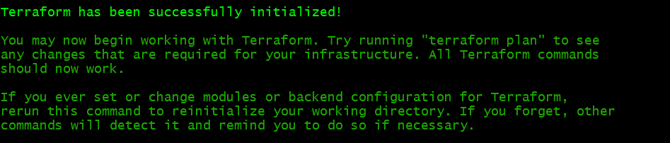
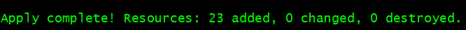
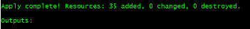
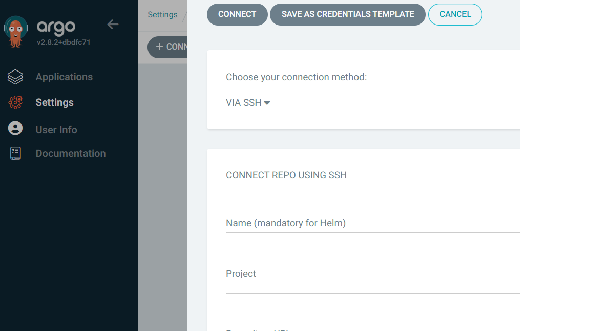
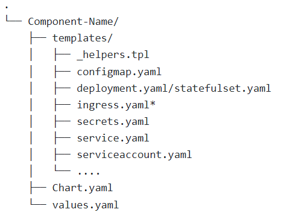

# Table of Contents
This section describes the step-by-step instructions required to create an Eclipse CSP environment using Amazon Elastic Kubernetes Service (EKS) Blueprints for Terraform. It includes infrastructure creation and Argo CD configuration.

This section includes the following:.

1. [Why use AWS EKS Blueprints](#why-use-aws-eks-blueprints)

2. [Prerequisites](#prerequisites)
   
3. [Deployment Instructions on using AWS EKS Blueprints](#deployment-instructions-on-using-aws-eks-blueprints)
   
4. [Configure Argo-CD](#configure-argo-cd)

5. [Deploying New Component](#deploying-new-component)

# Why use AWS EKS Blueprints
Kubernetes provides a robust ecosystem of popular open-source tools, often referred to as addons, that can be used to build production-grade clusters. Choosing and implementing the right tools for your needs and integrating your cluster with the rest of your AWS setup, especially in the case of EKS, is a time-consuming and operationally intensive task.

To streamline and expedite this process, we have used EKS Blueprints for Terraform framework to provision Well-Architected EKS clusters equipped with the necessary operational tooling and AWS integrations out of the box, which enables us to begin onboarding Eclipse CSP as quickly as possible.

# Prerequisites

Before starting, you must ensure following command line tools available/installed :

- Git
- AWS CLI
- Kubectl
- Terraform

Terraform can infer the following environment variables for AWS :  

`export AWS_ACCESS_KEY_ID="accesskey"`

`export AWS_SECRET_ACCESS_KEY="secretkey"`

You can find more information [here](https://registry.terraform.io/providers/hashicorp/aws/latest/docs#environment-variables)
You also need the following policies to perform the complete setup:

* eks:*,
* ec2:CreateVolume,
* ec2:DeleteVolume,
* ec2:AttachVolume,
* ec2:DetachVolume,
* ec2:AuthorizeSecurityGroupIngress,
* elasticloadbalancing:*,
* logs:*,
* s3:CreateBucket,
* s3:DeleteBucket,
* s3:PutBucket*,
* s3:GetBucket*,
* s3:ListBucket,
* s3:PutObject,
* s3:GetObject,
* s3:DeleteObject,
* route53:ListHostedZones,
* route53:GetHostedZone,
* route53:ListResourceRecordSets,
* route53:ChangeResourceRecordSets,
* secretsmanager:GetSecretValue,
* kms:Decrypt,
* autoscaling:*,
* autoscaling:CreateAutoScalingGroup,
* autoscaling:UpdateAutoScalingGroup,
* autoscaling:DeleteAutoScalingGroup,
* autoscaling:DescribeAutoScalingGroups,
* autoscaling:DescribeAutoScalingInstances,
* autoscaling:SetDesiredCapacity,
* autoscaling:TerminateInstanceInAutoScalingGroup,
* iam:PassRole,
* iam:GetRole,
* iam:CreateRole,
* iam:DeleteRole,
* iam:AttachRolePolicy,
* iam:ListAttachedRolePolicies,
* iam:ListRolePolicies,
* iam:GetPolicy,
* iam:GetPolicyVersion,
* iam:GetRolePolicy,
* kms:ListKeys,
* kms:Describe*,
* kms:Get*,
* kms:CreateKey,
* kms:DisableKey,
* kms:EnableKey,
* kms:Encrypt,
* kms:Sign,
* kms:Verify,
* kms:*,
* ec2:*,
* iam:Tag*,
* iam:CreateGroup,
* iam:CreateUser,
* iam:CreatePolicy,
* iam:CreatePolicyVersion,
* iam:PutRolePolicy,
* iam:GetAccountSummary,
* iam:CreateOpenIDConnectProvider,
* iam:GetOpenIDConnectProvider,
* iam:DeleteOpenIDConnectProvider,
* iam:ListOpenIDConnectProviders,
* iam:AddClientIDToOpenIDConnectProvider,
* iam:UpdateOpenIDConnectProviderThumbprint,
* iam:RemoveClientIDFromOpenIDConnectProvider,
* ecr:DescribeImages,
* ecr:GetAuthorizationToken,
* ecr:PutImage,
* ecr:BatchGetImage,
* iam:DetachGroupPolicy,
* iam:DetachRolePolicy,
* iam:DetachUserPolicy,
* iam:List*,
* iam:DeletePolicy,
* iam:DeletePolicyVersion,
* iam:DeleteRolePolicy
 

# Deployment Instructions on using AWS EKS Blueprints

Amazon Elastic Kubernetes Service (EKS) Blueprints for Terraform is designed to be consumed as follows:

**Reference**: Users can refer to the patterns and snippets provided to help guide them to their desired solution. Users will typically view how the pattern or snippet is configured to achieve the desired end result and then replicate that in their environment.

**Copy & Paste**: Users can copy and paste the patterns and snippets into their own environment, using EKS Blueprints as the starting point for their implementation. Users can then adapt the initial pattern to customize it to their specific needs.

## Step 1 : Fork/Clone the Repository

Either fork or clone the repository for infrastructure definitions from [AWS](https://github.com/aws-ia/terraform-aws-eks-blueprints/tree/main/patterns/gitops/getting-started-argocd) and [Workloads](https://github.com/eclipse-ecsp/csp-app-of-apps).

Update the terraform variables as required like AWS region, required EKS worker nodes and VPC details in Terraform variables.

## Step 2 : Create Infra and EKS cluster

We are using terraform to create the infrastructure. See the [Terraform Documentation](https://developer.hashicorp.com/terraform/tutorials/cli) for basic CLI commands

Run the following commands to initialize Terraform and deploy the EKS cluster:


`terraform init`

`terraform apply -target="module.vpc" -auto-approve'`

`terraform apply -target="module.eks" -auto-approve`

`terraform apply -auto-approve"`

>**NOTE:** Blueprints do not have a backend configured to store a terraform state file and manage state lock. You must configure a backend.

## Step 3 : Terraform Init

Run the following command to download all the modules from Terraform registry and to initialize provider plugins:


`terraform init`



## Step 4 : Terraform Apply

Run the following command and then verify the output:

`"terraform plan -target="module.vpc"`

After verifying the Terraform plan for VPC, run the following command:

 `"terraform apply -target="module.vpc" -auto-approve"` 

Wait for Terraform Apply to create the VPC modules.



After creating the VPC modules, run the following command to apply EKS:

`terraform apply -target="module.eks" -auto-approve`

Wait for Terraform Apply creates EKS



## Step 5 : Kubectl Configuration

To [retrieve kubectl config from EKS](https://docs.aws.amazon.com/eks/latest/userguide/create-kubeconfig.html), run the following Terraform output command:

`terraform output -raw configure_kubectl`

The expected output will have the following lines for you to run in your terminal:

`aws eks --region us-west-2 update-kubeconfig --name getting-started-gitops`

`export KUBECONFIG="/tmp/getting-started-gitops"`

You can now access the Kubernetes cluster. Check the cluster with some kubectl commands.

To get the Argo CD URL, you must install the AWS Load Balancer Controller. Without the Load Balancer Controller, the LB is not automatically created.

In the **getting-started-argocd** folder, you can find the **bootstrap.yaml** and **addons.yaml** files. There you can run Kubectl Apply to deploy addons.

You can find more information about Kubectl configuration [here](https://docs.aws.amazon.com/eks/latest/userguide/create-kubeconfig.html).

## Step 6 : Deploy Argo-CD addons
Run the following to bootstrap the addons using ArgoCD:

`kubectl apply -f bootstrap/addons.yaml`

Run following commands to get Argo username and password,

`echo "ArgoCD Username: admin"`
`echo "ArgoCD Password: $(kubectl get secrets argocd-initial-admin-secret -n argocd --template="{{index .data.password | base64decode}}")"`

You can access the Argo CD User Interface via the Load Balancer URL.

>**NOTE**: 
* >As part of the terraform scripts we don't have Aws Certificate Manager (ACM), for the first time we have to create a certificate and assign it to load balancer as required. 
* >DNS (route53): Domain configuration should be done manually and configure hosted zones before using annotations to update DNS A record from load balancer, ExternalDNS is not deployed so ingress cannot register load balancer to host name. 
* >Deploy Amazon Elastic Block Store (Amazon EBS) Container Storage Interface (CSI) drivers to handle creation of the EBS volumes in the EKS cluster. You must configure the Web Application Firewall (WAF) with the required or default AWS-provided default WAF rules

# Configure Argo-CD

## Configure Repositories
The reference application deployment uses the Argo CD App of Apps. You must configure the repositories in the Argo CD.

Add the Helm charts and App of Apps chart URLs. In the Argo CD Web portal, navigate to the **Settings → Connect Repo** in the navigation pane.
>**Note:** Repository configuration in connect repo would be required only for Private repositories with credential/token.



## Create Apps to Argo-CD
For initial application deployment, we must create/add the apps via the Argo CD User Interface.

We have the following App of Apps to group logically based on their nature of functionality:

- **Core Data Platform** - All shared/backbone components.
- **UIDAM** - Identity and Access Management components
- **CSP Services** - All the service components

In the navigation pane of the Argo CD Web portal, navigate to **Applications → New APP** to provide the application's App of App details.
We can set up the app as follows:

- **Form Field** - Need to fill each form fields
- **Yaml update** - Single update with Yaml configuration.
### Core-Data-Platform

```
project: default
source:
  repoURL: 'https://github.com/eclipse-ecsp/csp-app-of-apps'
  path: data-platform
  targetRevision: HEAD
destination:
  server: 'https://kubernetes.default.svc'
  namespace: core-data-platform
syncPolicy:
  automated: {}
  syncOptions:
    - CreateNamespace=true
```


### UIDAM
```
project: default
source:
  repoURL: 'https://github.com/eclipse-ecsp/csp-app-of-apps'
  path: uidam
  targetRevision: HEAD
destination:
  server: 'https://kubernetes.default.svc'
  namespace: uidam-services
syncPolicy:
  automated: {}
  syncOptions:
    - CreateNamespace=true
```

### CSP Services
```
project: default
source:
  repoURL: 'https://github.com/eclipse-ecsp/csp-app-of-apps'
  path: csp-services
  targetRevision: HEAD
destination:
  server: 'https://kubernetes.default.svc'
  namespace: csp-services
syncPolicy:
  automated: {}
  syncOptions:
    - CreateNamespace=true
```


We can view all the applications after deployment in Argo CD. We can also navigate to individual applications to view the status of the application, its logs, and so on.


# Deploying New Component

There are times when a new component must be deployed in an existing and running environment. The following is a high level description of the steps required to for such a deployment.


## Pre-requisite

The new component is already created, as described in CSP Repository [here](https://github.com/eclipse-ecsp).

The component is built and a Docker image is created and available as a GitHub package [here](#available-soon).

>**Note:** To deploy a third-party component, we do not need to create images. Rather we use the images directly as provided by the third-party.


## Add Helm Chart
To add a Helm chart in CSP services, You must create a folder/path with the component name in the charts repo.

You must then create a Helm file structure, as shown by the following: [charts repo](https://github.com/eclipse-ecsp/csp-charts) to add helm chart for csp-services.

>**Note:** For more information about Helm chart creation, see  [Helm Documentation](https://helm.sh/docs/topics/charts/)  



**Chart.yaml** - Define Chart Name, Description, Version and type of chart either Library or Application.

**values.yaml** - important for templates and this file contains the default values for a chart eg: image details, replicas and other configmap default values.

**templates**   - directory is for template files. When Helm evaluates a chart, it will send all of the files in the templates/ directory through the template rendering engine. It then collects the results of those templates and sends them on to Kubernetes.

**_helpers.tpl** - place to put template helpers that you can re-use throughout the chart.

**configmap.yaml** - Injecting configuration parameters to the container or creating configuration files inside the container.

**deployment.yaml/statefulste.yaml**- manifest for creating a Kubernetes container. Deployment for stateless apps and other side is statefulset.

**ingress** - (Optional) to expose application externally, manage external access and providing http(s) routing rules.

**secrets.yaml** - Inject the Kubernetes secrets to the app/container environment.

**service-account** - (Optional) Non human account and distinct identity within a cluster.

**service.yaml** - A basic manifest for creating a service endpoint for your deployment.

>**Note:** Please make sure all the secrets are defined in Kubernetes secrets and it should be injected to the app/container.


## Update  app-of-apps
To deploy the component in Argo CD, we must update the Argo CD App of Apps with the new component chart details in the [repository](https://github.com/eclipse-ecsp/csp-app-of-apps).

The following App of Apps are grouped logically based on their nature of functionality: 


- **Core Data Platform** - All shared/backbone components.
- **UIDAM** - Identity and Access Management components
- **CSP Services** - All the service component

You must do the following:

* Choose the correct path to add the new component in App of Apps. 
* In the applications section of the `values.yaml file` , enable the new component as follows: 

```
applications:
  new-component-name:
    enabled: true
```
* Create the new application YAML file in the template folder of the corresponding App of Apps. Update the component name and update the sync-wave number NN with the deployment order of the application. If there is no required order, use a higher value than any other applications.

```
{{- if (index .Values.applications "new-component-name").enabled }}
apiVersion: argoproj.io/v1alpha1
kind: Application
metadata:
  name:new-component-name
  namespace: {{ .Values.argocd.namespace }}
  finalizers:
  - resources-finalizer.argocd.argoproj.io
  annotations:
    argocd.argoproj.io/sync-wave: "NN"
spec:
  project: {{ .Values.argocd.project }}
  destination: {{ toYaml .Values.argocd.destination | nindent 4 }}
  syncPolicy: {{ toYaml .Values.argocd.syncPolicy | nindent 4 }}

  source:
    path: new-component-name
    repoURL: {{ .Values.argocd.sourceRepoURL }}
    targetRevision: {{ .Values.argocd.targetRevision }}
{{- end }}

```

>**Note:** The chart paths are already defined in the corresponding App of Apps `values.yaml` file. 

After App of Apps updates and commits to the Main branch, the application automatically deploys to the target environment and you can view it in the Argo CD Web portal.
