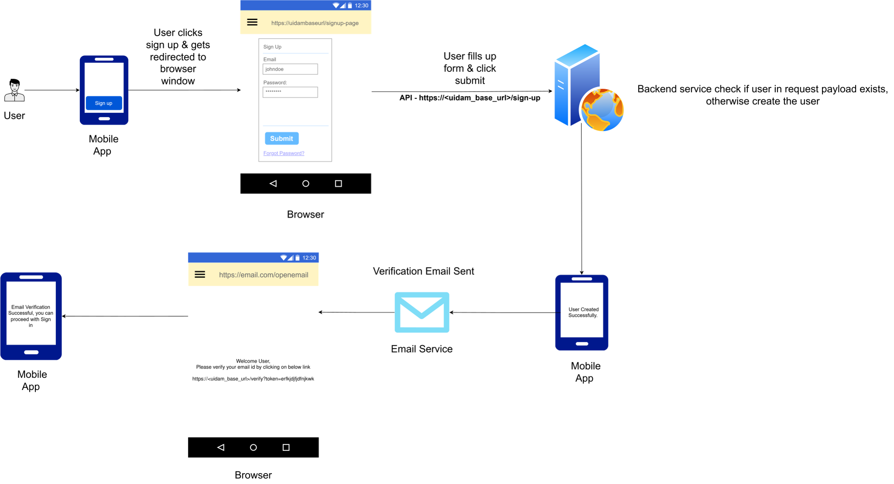
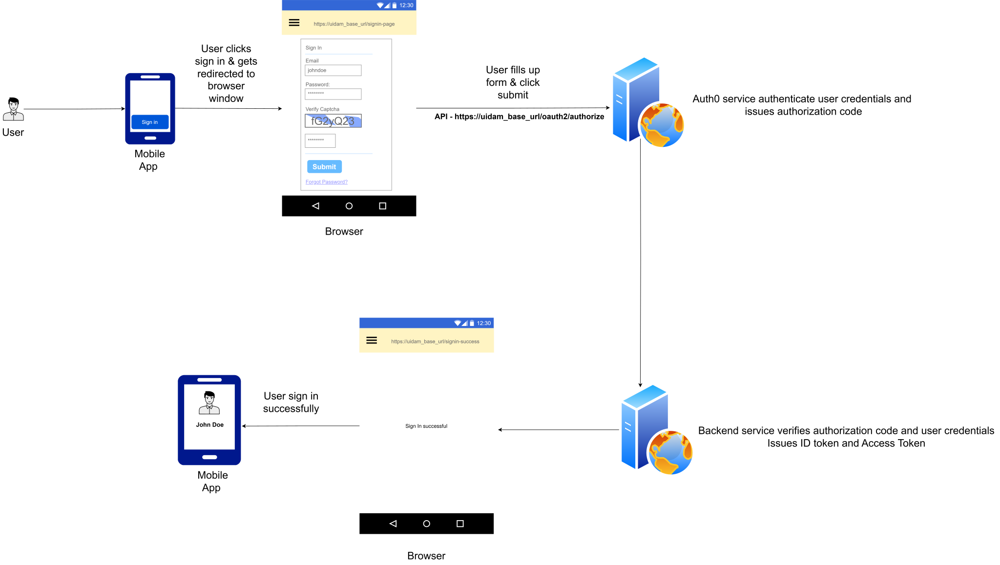
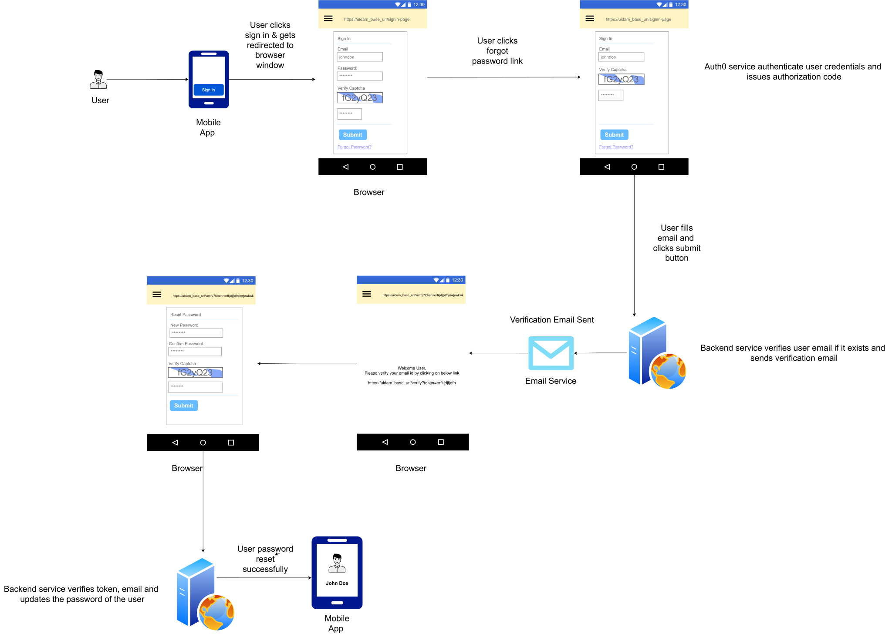
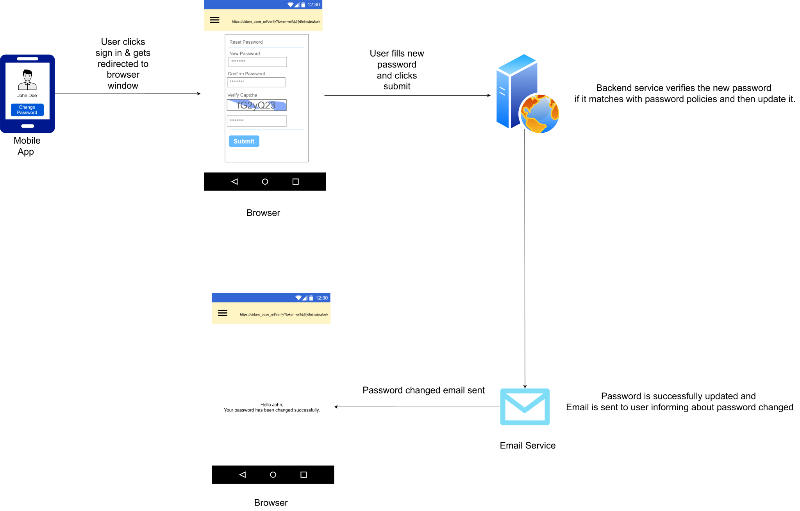
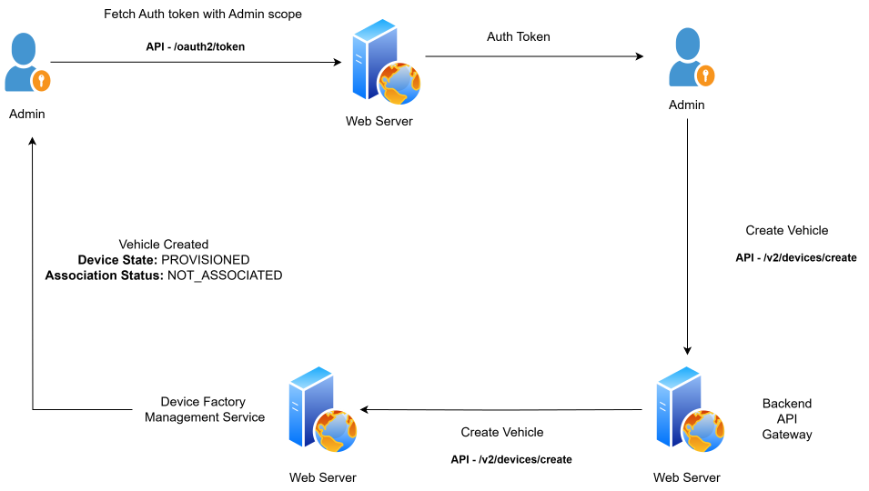
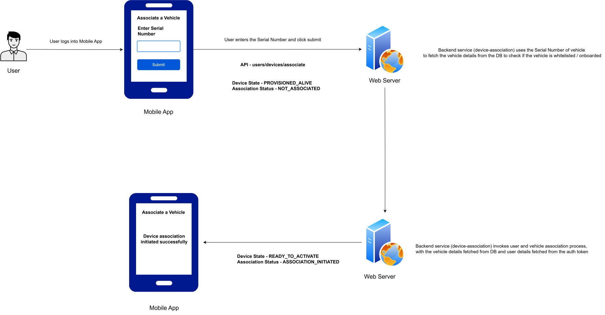
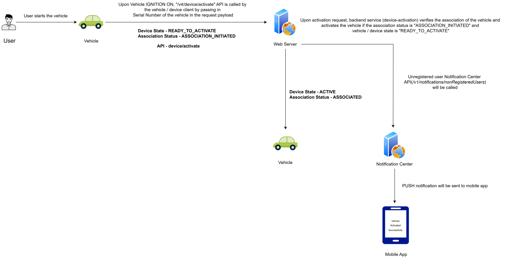

---
hide:
    - toc
---

# Use Case Diagrams

=== "User Management"

    ## Sign up Flow

    

    **Precondition** - Connect app is installed in mobile.

    - User clicks on signup button on mobile application which launches UIDAM signup page (webpage in application window)
    - This is a public signup page (/SignUp) with captcha to prevent bots creating the user.
    - Backend will take user details like email-id(username), first name, last name and password, validates password against password policies and creates user.
    - Sends email verification link to the email-id(username) entered by user in signup page.
    - On successful verification by clicking the link provided in the verification email, user will be able to login to mobile app.

    ## Sign in Flow

    

    **Precondition** - Connect app is installed in mobile and Signup process is complete.  

    - User clicks on sign-in(Login: /oauth2/authorize) button on mobile application which launches UIDAM sign-in page (webpage in application window)
    - This page will be landed from mobile app using oAuth grant type: Authorisation code (PKCE) flow.
    - This is a public signup page (/SignUp) with captcha to prevent bots creating the user
    captcha is configurable, either always or after certain number of failure attempts or specific to user.
    - Post successful login, user should be able to get auth code sent to mobile apps redirect uri provided in login page link.
    - Mobile app will generate access token(/oauth2/token) using the authorisation code received from UIDAM authorisation server.
    - This token will be used for further api access.

    ## Forgot Password Flow

    

    **Precondition** - Connect app is installed in mobile and Signup process is complete.  

    - User clicks on sign-in(Login: /oauth2/authorize) button on mobile application which launches UIDAM sign-in page (webpage in application window)
    - User clicks on forgot password option in public page.
    - Public webpage will show option to enter username and challenge captcha to prevent bots anonymous access.
    - On successful user identification, backend will send verification link to registered email-id
    - On clicking link, backend will validate the token in link and if it is valid, Public web page will be opened.
    - User will be able to create new password, backend validates password against password policies
    - Confirmation page will be shown to user once password is changed.
    - User will be able to login with new password.

    ## Change Password Flow

    

    **Precondition** - Connect app is installed in mobile, user signed in to mobile application.

    - User clicks on change password option in mobile app(the request will go to the backend with the user token),
    - Backend will verify and extract the userid from the token, will send verification link to registered email-id
    - On clicking link, backend will validate the token in link and if it is valid, Public web page will be opened.
    - User will be able to create new password, backend validates password against password policies
    - Confirmation page will be shown to user once password is changed.
    - User will be able to login with new password.

=== "Device Management"

    ## Create Device/Vehicle Flow

    

    **Precondition** - Device/Vehicle details are available and valid

    - Device/Vehicle Creation will be done by admin (OEM) by calling backend api
    - Admin gets oauth token with admin scope from auth server
    - Admin calls backend api-gw to create a vehicle with necessary vehicle details (eg: serial number, IMEI etc)
    - Api-gw forwards the requests to Device factory management service which creates the vehicle.
    - Initial state when vehicle created would be, Device State: PROVISIONED and Association Status: NOT ASSOCIATED
    - When vehicle is created, it is considered on-boarded and whitelisted.

    ## Associate Device/Vehicle With User Flow

    
    
    **Pre Condition** - User is created and logged in to mobile application.(mobile app will have oauth token of user logged in)  

    - Vehicle association can be done by user as well as admin.
    - User will use mobile application to associate vehicle.  
    - User enters serial number of vehicle in to mobile application for which association is required
    - Mobile application calls associate backend API with vehicle details and appropriate scope(oauth token)
    - Device-association backend service checks for the vehicle serial number in database and identifies whether it is onboarded/whitelisted or not
    - Backend service invokes association process with the whitelisted vehicle details from DB and User details from token
    - On successful initiation of association, user will see success response (association initiated successfully) on mobile app
    - Post successful association initiation, at backend, Device State would be READY_TO_ACTIVATE, Association Status would be ASSOCIATION_INITIATED

    ## Activate Device/Vehicle Flow

    
    
    **Pre Condition** - User and Vehicle association is successfully initiated by user on mobile application.
 
    - User starts the vehicle
    - When user turns ignition on, vehicle (device client present in vehicle) calls activate api of backend.
    - Device activation backend service will check if Device State is READY_TO_ACTIVATE and Association Status is ASSOCIATION_INITIATED and then activates the vehicle.
    - On Successful activation, at backend, Device State would be ACTIVATED and Association Status would be ASSOCIATED  
